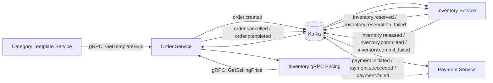
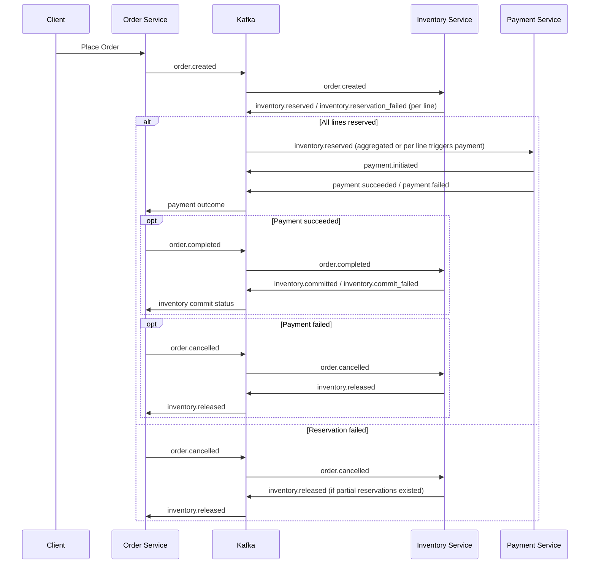

## E-commerce Microservices Architecture

This document describes the overall architecture of the `E-commerce-Microservice` repository: service boundaries, technology choices, gRPC internal service calls, the Kafka-based Order Saga (choreography style), and all currently defined event topics.

---
### High-Level Overview

We implement a domain‑driven, polyglot microservice system. Each bounded context owns its data and publishes domain events over Kafka. Cross‑service synchronous lookups (low-latency reads) leverage gRPC. Long‑running business transactions (placing an order through fulfillment and payment) are coordinated via an event-driven Saga without a central orchestrator (choreography pattern).



---
### Services

| Service | Tech Stack | Primary Responsibilities | Sync Interfaces | Async Interfaces |
|---------|------------|--------------------------|-----------------|------------------|
| Order Service (`order_service/`) | Java (Spring Boot) | Manage lifecycle of customer orders; emit initial order events; react to payment/inventory outcomes; decide completion/cancellation | gRPC client: InventoryPricing, CategoryTemplateService | Produces `order.created`, `order.cancelled`, `order.completed` (inferred); Consumes inventory & payment topics |
| Inventory Service (`inventory_service/`) | .NET (C#) | Stock reservation, release, commit; pricing lookup via gRPC service | gRPC server: `InventoryPricing.GetSellingPrice` | Consumes `order.created`, `order.cancelled`, `order.completed`; Produces `inventory.reserved`, `inventory.reservation_failed`, `inventory.released`, `inventory.committed`, `inventory.commit_failed` |
| Payment Service (`payment_service/`) | Node.js (Express, KafkaJS, Razorpay integration) | Payment initiation, verification, and outcome events; reacts to inventory reservation | (None direct) | Consumes `inventory.reserved`; Produces `payment.initiated`, `payment.succeeded`, `payment.failed` |
| Category Template Service (`category-template-service/`) | Java (Spring Boot + gRPC) | Provide category & attribute templates for products | gRPC server: `CategoryTemplateService.GetTemplateById` | (None) |
| Product Catalog Service (`product_catalog_service/`) | .NET (C#) | Product / category catalog (uses category template proto) | Potential gRPC client for CategoryTemplate (proto present) | (Not yet producing/consuming topics in scanned code) |

Assumptions noted where event production not yet visible in scanned excerpts (e.g. `order.created` origin). Update if code differs.

---
### gRPC Internal Service Calls

Two proto definitions facilitate synchronous intra‑domain queries:

1. `category_template.proto` (package `categorytemplate.v1`)
   - Service: `CategoryTemplateService`
   - Method: `GetTemplateById(GetTemplateByIdRequest) -> GetTemplateByIdResponse`
   - Purpose: Order / Catalog services can enrich product/category operations with template metadata (attributes, department, category structure) without coupling to the template DB schema.

2. `inventory_pricing.proto` (package `inventory.pricing.v1`)
   - Service: `InventoryPricing`
   - Method: `GetSellingPrice(PriceRequest) -> PriceResponse`
   - Purpose: Order service can query real‑time availability and selling price for a given `store_id` and `product_sku` prior to finalizing order totals or performing validation.

Implementation Notes:
- Java and .NET share the same pricing proto enabling polyglot generation.
- gRPC is deliberately limited to read‑oriented operations; all state changes (reserve / commit / payment etc.) flow asynchronously for resilience and temporal decoupling.
- Failures in gRPC calls (e.g., pricing unavailable) should fall back to cached pricing or raise validation errors before emitting `order.created`.

---
### Kafka Event Topics & Ownership

| Topic | Produced By | Consumed By | Intent |
|-------|-------------|------------|--------|
| `order.created` | Order Service | Inventory Service | Start Saga: request inventory reservations for each order line. |
| `inventory.reserved` | Inventory Service | Payment Service, Order Service | Reservation success for a line item enabling payment initiation. |
| `inventory.reservation_failed` | Inventory Service | Order Service (and optionally Payment Service) | Indicates inability to reserve; triggers cancellation / compensation. |
| `payment.initiated` | Payment Service | Order Service | Payment flow started; can timebox for completion. |
| `payment.succeeded` | Payment Service | Order Service | Payment confirmed; Order may emit `order.completed`. |
| `payment.failed` | Payment Service | Order Service | Payment failure; triggers `order.cancelled` and inventory release. |
| `order.cancelled` | Order Service | Inventory Service | Compensation: release previously reserved inventory. |
| `inventory.released` | Inventory Service | Order Service | Confirmation of release (useful for audit / eventual consistency). |
| `order.completed` | Order Service | Inventory Service | Finalization request to commit inventory reservations. |
| `inventory.committed` | Inventory Service | Order Service | Inventory permanently deducted; order reaches terminal success state. |
| `inventory.commit_failed` | Inventory Service | Order Service | Commit failure; may trigger retry or manual intervention. |

Internal configuration also ensures topic provisioning (see `KafkaOptions.cs`). Add ACLs / partitions sizing per workload in production.

---
### Order Saga (Choreography) Lifecycle

The order placement process is a distributed transaction with compensations instead of a 2‑phase commit.



Key Characteristics:
1. Choreography: No central orchestrator; each service reacts autonomously to events it cares about.
2. Idempotency: Event handlers (e.g., inventory reservation) should be idempotent—repeated `order.created` with same key must not double reserve.
3. Compensation: Failures result in `order.cancelled` and inventory release instead of reversing commits.
4. Isolation Boundaries: Payment initiation only after positive reservation events; inventory commit only after successful payment.
5. Extensibility: Additional steps (shipping, notification) can subscribe to terminal events `inventory.committed` or `payment.failed`.

Failure & Retry Strategy:
- Transient errors in reservation or commit can be retried with backoff; persistent failure publishes `inventory.reservation_failed` / `inventory.commit_failed`.
- Payment verification failure leads to compensating cancellation; downstream release ensures eventual consistency of stock levels.

Correlation:
- Partition / message key typically = `orderId` to maintain causal ordering of events for a single order across topics.
- Payloads (seen in handlers) include line item details (`storeId`, `productSku`, `quantity`) to avoid synchronous fan‑out lookups.

---
### Message Schemas (Observed Fragments)

Inventory Reservation Result (from `OrderCreatedHandler.cs`):
```json
{
  "orderId": "<string>",
  "storeId": <int>,
  "productSku": "<string>",
  "quantity": <int>,
  "status": "reserved" | "reservation_failed",
  "amount": <decimal>
}
```

Payment Outcome (from `payment.service.js`):
```json
{
  "orderId": "<string>",
  "transactionId": "<string>",
  "status": "pending" | "succeeded" | "failed",
  "reason": "<string?>"
}
```

Inventory Commit / Release (from handlers):
```json
{
  "orderId": "<string>",
  "storeId": <int>,
  "productSku": "<string>",
  "quantity": <int>,
  "status": "released" | "committed" | "commit_failed"
}
```

Normalize / version these schemas in an Avro or protobuf registry for evolution (future improvement).

---
### Reliability & Operational Considerations

| Concern | Current State | Recommendation |
|---------|---------------|----------------|
| Topic Provisioning | Hard-coded list in `KafkaOptions.cs` | External infra-as-code or admin client startup check. |
| Schema Evolution | Inline JSON dictionaries | Adopt schema registry & versioning. |
| Observability | Logging via service loggers | Add trace IDs & distributed tracing (OpenTelemetry). |
| Idempotency | Implied by repo operations | Enforce unique reservation keys (storeId+sku+orderId). |
| Dead Letter | Not observed | Create DLQ topics for poison messages (e.g., `inventory.reservation_failed.dlq`). |

---
### Extending the Saga

Potential future events:
- `shipping.requested`, `shipping.dispatched`, `shipping.failed`
- `notification.email_sent`
Integrate by subscribing to existing terminal states (`payment.succeeded`, `inventory.committed`) and emitting follow‑up domain events without modifying existing services (open/closed principle).

---
### Quick Reference

gRPC Services:
```
CategoryTemplateService.GetTemplateById(id)
InventoryPricing.GetSellingPrice(store_id, product_sku)
```

Kafka Topics:
```
order.created
order.cancelled
order.completed
inventory.reserved
inventory.reservation_failed
inventory.released
inventory.committed
inventory.commit_failed
payment.initiated
payment.succeeded
payment.failed
```

