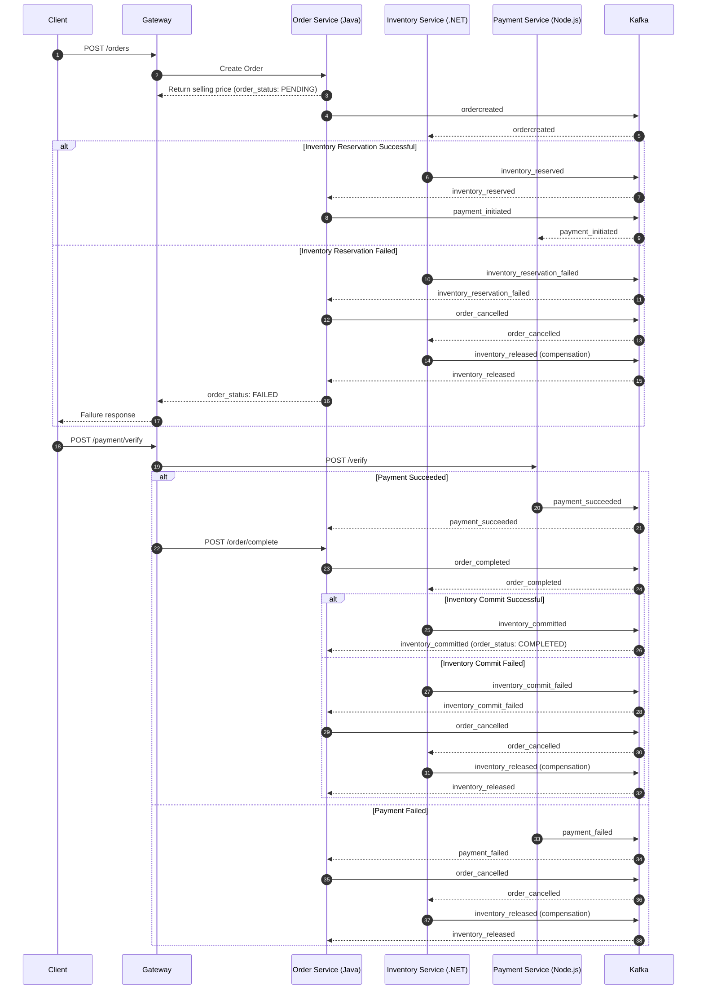

# E-commerce Microservices

This repository contains a polyglot e‑commerce system composed of multiple services:
- Order Service (Java, gRPC/Kafka)
- Inventory Service (.NET)
- Payment Service (Node.js)
- Shared messaging via Kafka

## Order Saga Orchestration (Happy path, failures, and compensations)

The sequence below shows the end‑to‑end saga for placing an order, reserving inventory, processing payment, and either committing inventory or compensating on failure.

Notes
- All service-to-service events are published/consumed via Kafka.
- Order statuses progress through PENDING → PAYMENT_INITIATED → COMPLETED or FAILED.
- Inventory uses a reservation pattern with commit on success and release on failure.

